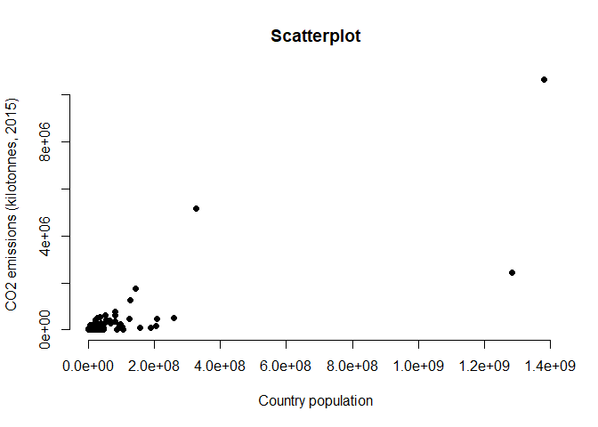

<!-- README.md is generated from README.Rmd. Please edit that file -->

# samplr

<!-- badges: start -->
<!-- badges: end -->

The goal of samplr is to illustrate the workflow to create a minimal
package.

## Installation

You can install the development version of samplr from
[GitHub](https://github.com/) with:

``` r
# install.packages("devtools")
devtools::install_github("paezha/samplr")
```

## Example

This is a basic example which shows you how to solve a common problem:

``` r
library(samplr)
## basic example code
```

Package {samplr} includes a single data object, which can be loaded like
so:

``` r
data("energy_and_emissions")
```

Here is a scatterplot of population by country and $CO_2$ emissions in
2015: 
